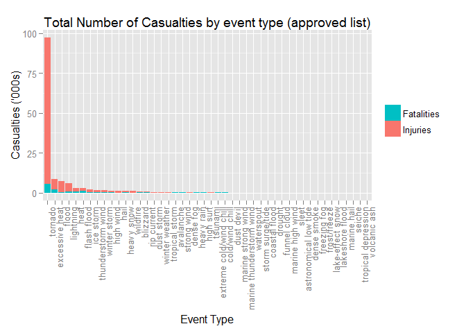
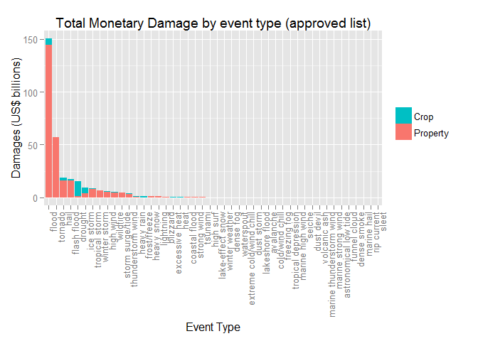

Analysing Economical and Population Damage caused by severe weather events
==========================================================================
  
Synopsis
--------

Using data from US National Oceanic and Atmospheric Administration's storm database, this publication seeks to analyse the economic and population damage caused by severe weather events. The most damaging to population health is tornado and most damaging to economy is flood.  

Data Processing
---------------

Setting working directory

```r
setwd("~/GitHub/coursera/05.ReproducibleResearch/PeerAssessment2")
```

Loading required libraries

```r
library(data.table)
library(reshape)
library(ggplot2)
library(plyr)
```

Reading local data file. For ease of reading and calling, the column names are renamed to lowercase.

```r
stormData <- data.table(read.csv(".//repdata-data-StormData.csv"))
names(stormData) <- tolower(names(stormData))
```

We filter the data to only select those columns that are relevant to our analysis.

```r
stormData <- subset(stormData, select= c("evtype", "fatalities", "injuries", "propdmg", "propdmgexp", "cropdmg", "cropdmgexp"))
```

From the National Weather Service Storm Data Documentation, there is a list of 48 event types that are considered official.

```r
approved_list <- tolower(c("Astronomical Low Tide", "Avalanche", "Blizzard", "Coastal Flood", "Cold/Wind Chill", "Debris Flow", "Dense Fog", "Dense Smoke", "Drought", "Dust Devil", "Dust Storm", "Excessive Heat", "Extreme Cold/Wind Chill", "Flash Flood", "Flood", "Frost/Freeze", "Funnel Cloud", "Freezing Fog", "Hail", "Heat", "Heavy Rain", "Heavy Snow", "High Surf", "High Wind", "Hurricane (Typhoon)", "Ice Storm", "Lake-Effect Snow", "Lakeshore Flood", "Lightning", "Marine Hail", "Marine High Wind", "Marine Strong Wind", "Marine Thunderstorm Wind", "Rip Current", "Seiche", "Sleet", "Storm Surge/Tide", "Strong Wind", "Thunderstorm Wind", "Tornado", "Tropical Depression", "Tropical Storm", "Tsunami", "Volcanic Ash", "Waterspout", "Wildfire", "Winter Storm", "Winter Weather"))
```
"propdmgexp" and "cropdmgexp" are the exponents value of damages. By matching the propdmgexp character to its corresponding number of zero (0), and multiplying it by propdmg or cropdmg, we will obtain the true value in terms of dollars. We will also take this opportunity to create new columns of total casualties, econdmg, and lower-casing evtype.

```r
match_char <- c("K", "M", "B")
exp10 <- 10 ^ c(3, 6, 9, 0)

stormData <- mutate(stormData, casualties = fatalities + injuries,
                    propdmg = propdmg * exp10[match(propdmgexp, match_char, nomatch=4)],
                    cropdmg = cropdmg * exp10[match(cropdmgexp, match_char, nomatch=4)],
                    econdmg = propdmg + cropdmg,
                    evtype = tolower(evtype)
                    )
```
Finally, we subset the data to get those evtype that appears in the official list. As we are interested in the impact, records that do not have either econdmg or casualties will be removed. Then, we will sum up the columns by evtype and then melt the dataset on evtype.

```r
stormData <- stormData[stormData$evtype %in% approved_list]
relevant <- subset(stormData, econdmg!=0 | casualties!=0, 
                   select=c("evtype", "fatalities", "injuries", "casualties", "propdmg", "cropdmg", "econdmg"))
relevant_sum <- ddply(relevant, .(evtype), colwise(sum))
relevant_melt <- melt(relevant_sum, id="evtype")
```

Results
-------

To answer the 2 questions raised, each question will have its own chart ranked in terms of most damaging to least. 

```r
ggplot(data = subset(relevant_melt, variable %in% c("fatalities", "injuries")), 
       aes(x=reorder(evtype, -value, sum), y=value/1000, fill = reorder(variable, -value, sum))) + 
  geom_bar(stat="identity") +
  scale_fill_discrete("", labels = c("Injuries", "Fatalities"), guide = guide_legend(rev = T)) +
  theme(axis.text.x = element_text(angle = 90, hjust = 1)) +
  xlab("Event Type") +
  ylab("Casualties ('000s)") +
  ggtitle("Total Number of Casualties by event type (approved list)")
```


The most costly in term of population health is that of tornado. Tornado has very high count of injuries and fatalities is almost equavalent to other event type's injury count. 

```r
ggplot(data = subset(relevant_melt, variable %in% c("propdmg", "cropdmg")), 
       aes(x=reorder(evtype, -value, sum), y=value/10^9, fill = reorder(variable, -value, sum))) + 
  geom_bar(stat="identity") +
  scale_fill_discrete("", labels = c("Property", "Crop"), guide = guide_legend(rev = T)) +
  theme(axis.text.x = element_text(angle = 90, hjust = 1)) +
  xlab("Event Type") +
  ylab("Damages (US$ billions)") +
  ggtitle("Total Monetary Damage by event type (approved list)")
```


While tornado may be the most harmful to health, it ranks second in terms of economical damage. Flood tops the ranking with figures almost doublind that of the runner up. 
